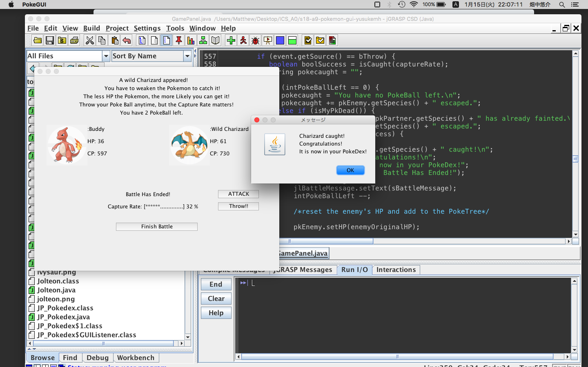

  In one of the Programming courses at Kapiolani Community College, students had an individual project and I created a game where the game in Pokemon battle was simulated. For the whole semester, Java was taught by the professor using the concept of Pokemon. Students consequitively worked on creating classes of and for Pokemons. For the last component of the class, which was GUI using Java, each individual student wrote a code for the game. Since GUI was not deeply taught in class, I was expected to do a lot of research on my own to cmoplete the assignment. This helped me realize that there is plenty of resources available online, and it is not impossible, if anything, to teach myself how to write a code.

  The requirement for the assignment was to simply create a random instance of a Pokemon and ask user to add to data structure with appropriate GUI provided for the user. However, As I worked on the project, I became more and more passionate and added many other features to my game. First, I made it posible for user to choose and keep a specific Pokemon as their partner. Then, instead of just adding another Pokemon to the data structure, I implemented the battle; user can now use the partner to fight the wild pokemon. Unless the wild pokemon is weak enough, and your partner Pokemon is still alive, the user cannot catch the Pokemon.

  The code needed to be pretty complecated and long, so I spent significant amount of time for the project. As a result, I got full credit for the project and I received an email from the professor, saying my game was one of the best that she had seen. Following the semester, I was recommended by the professor for peer mentor at Kapiolani Community College.

  Throught this project, I learned some of the significant aspects of computer science: the accesibility of open resources and the endless possibility of implementation. By working by myself, it took me a lot of time and effort. However, what I leared from this project was totally worth it.

