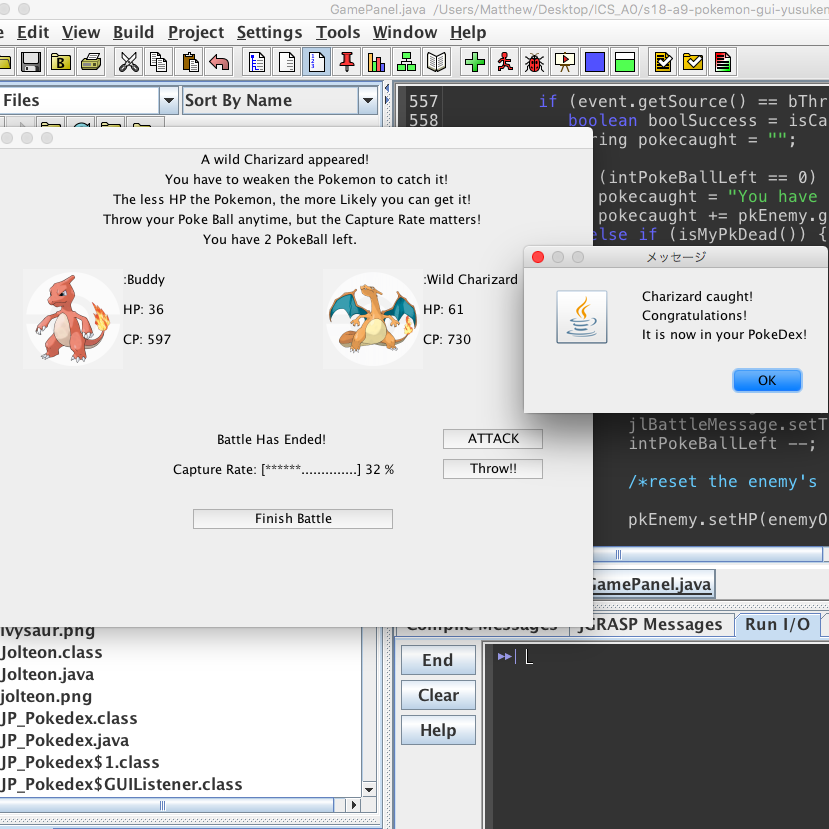

This project was assigned in ICS 212 as individual project. In ICS 212, students learned how to code in C and C++, with concentration on dealing with pointers. The purpose of this project was to understand how to use pointers to manage data in heap memory using C and C++ syntax. Each student was assigned to write a code which provides user interface and store data in text file. The whole project was divided into smaller assignments and for each assignment, students wtote codes for partial functions to the total project. Everithing needed to work on Unix, so along with C and C++, we needed to acquire knowledge about how Unix works.

Since this was an individual project, everything needed to be completed by myself. 
