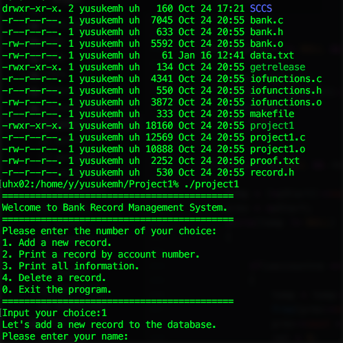

This project was assigned in ICS 212 as an individual project. In ICS 212, students learned how to code in C and C++, with concentration on dealing with pointers. The purpose of this project was to understand how to use pointers to manage data in heap memory using C and C++ syntax. Each student was assigned to write a code which provides user interface and stores data in text file. The whole project was divided into smaller assignments and for each assignment, students wrote codes for partial functions to the total project. Everything needed to work on Unix, so along with C and C++, we needed to acquire knowledge about how Unix works.

Since this was an individual project, everything needed to be completed by myself. Due to the nature of the course, learning how to code was almost completely dependent on each student. That meant I had to do so much research to figure out how to write codes in C and C++. This took the most of the time because I had little experience in those languages. Thanks to the broad accessibility to the enormous amount of resources in the Internet, I was able to do research necessary for the project.

Throughout the project, I learned how dividing the big problem into the smaller helps me work on a bigger project. Each time I complete one of the small assignments, I made sure the code works perfectly without any bug, because the code will eventually be a part of the whole project. Working little by little making sure the code works has become my habit whenever I have to write a code.
