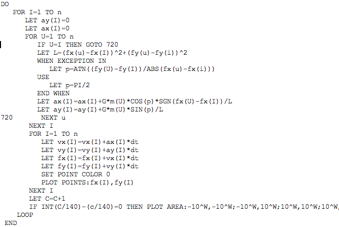

This was the very first project in my life that I worked on by myself. The first programming language I learned was BASIC. I was 18 years old when I worked on this project and the only language I knew was BASIC, which my father taught me. Using my knowledge about physics, I wanted to try to test my skill to simulate the movement of stars in the space. The program simulates the movement of multiple objects with velocity, coordinates, acceleration, and mass. I used the actual equation to calculate the variables for each objects, and printed out to the screen so that user can actually see the movement.

This project was triggered by myself with a simple intention to represent the physical phenomenon. I spent a lot of time to make the code work but to keep the code simple at the same time. Since this project was not by any means assigned by anyone, I was able to work freely on the code. Not much research was needed, because I knew I would be able to write the code. I spent adequate time for analyzing the algorithm and what I actually had to do was to translate the algorithm into programing language and find bugs.

This project taught me how bugs can be very small and trivial, but yet influential. I also learned how difficult it is to find those tiny bugs by myself. When writing the code, instead of working on the code repeatedly for an appropriate period of time, I tended to spend very long time at once. I learned how harmful this habit would be because whenever the code didn't work, I spent a lot of time and yet I cannot find any bug. It was not until I had given up writing and came back to the code a while after that I found a very simple bug in my code. Then I realized my brain was in a certain state which somehow prevented me from working properly. This was probably the very first time that I learned something that I have to keep in mind even now and in the future. I learned the lesson purely as my own experience. 
