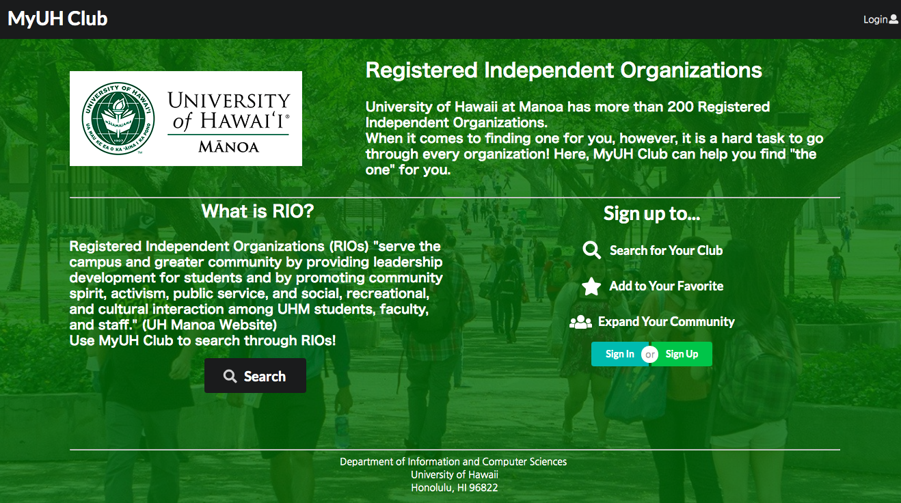

This project was assigned as final project for ICS314 at UH Manoa. Throughout the semester, the class focused on development of web app using semantic ui.

Since it was a group project, I worked with three other great students; my very first project to work on with other people. Our team was assigned to make an web app to deal with all Registered Independent Organizations (RIOs) at UH Manoa, which adds up to over two hundred, so that users can find which RIO would fit them. User can have their own account to save their favorite RIO and to have an access to developers. As one of the objectives of the class, we learned how to use MongoDB, so we also incorporated the database to easily deal with data in a big scale. 

Within the team, I mainly worked on UI design and data manipulation. Using Semantic UI React was a bit frustrating while trying to figure out how I can code so that the web pages look as I wanted to. Besides working on UI design and data manipulation, the next biggest achievement through this project was that I learned how to work on a single project with multiple people at the same time. This was first time I have ever experienced merge conflict when merging branches. I found it very helpful if we try to eliminate the possibility to have merge conflict, because figuring out the best way to solve conflict was sometimes challenging. 

Although it seemed overwhelming at the beginning, our team was able to accomplish the goal to have an webapp that actually works. The amount of work done was not subtle by any means, but we contributed to each other for the final goal. From planning out the structure to fixing bugs, everything was a new experience to me in terms of working with teammates. Unlike all other project that I had worked on by myself, there were much more aspects that were both helpful and challenging. 